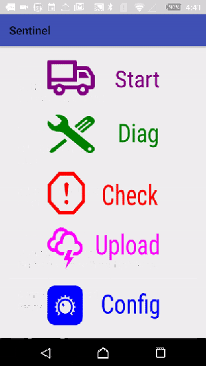

Preface
==========

Sentinel is a lightweight Obd2/ELM327 diagnostic software on Android. It is a sample application to show how to interact with Obd2 dongle device via Bluetooth, Wifi not finished yet. It also provides facilities to integrate ELM327 and compatiable devices.

Sentinel's goals are

* To provide advanced integration with IoT system, which next preparing project.
* Modular architecture, programmers can decide to write more plugins without affect the others coding.
* This project is about designing a software tool capable of talking to your vehicle's engine control unit (ECU) and getting all sorts of data from it, especially particular trouble codes.
* User can reads data from his vehicle online and decides to send to maintenance plant (service center, motor research center) via cloud Service.

Installation
---------------
- Download and open an Android Studio project.

Features
---------------
- The app uses Model-View-Control (MVC) architecture. Only one Activity and each of the fragments maps to relative view. The directory layer shows what funtions(Class modules) to do.
- open source free code

